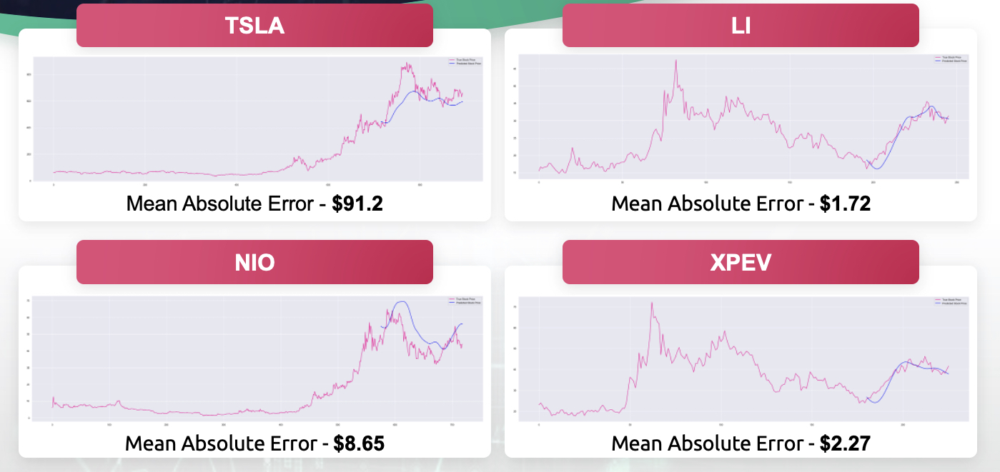
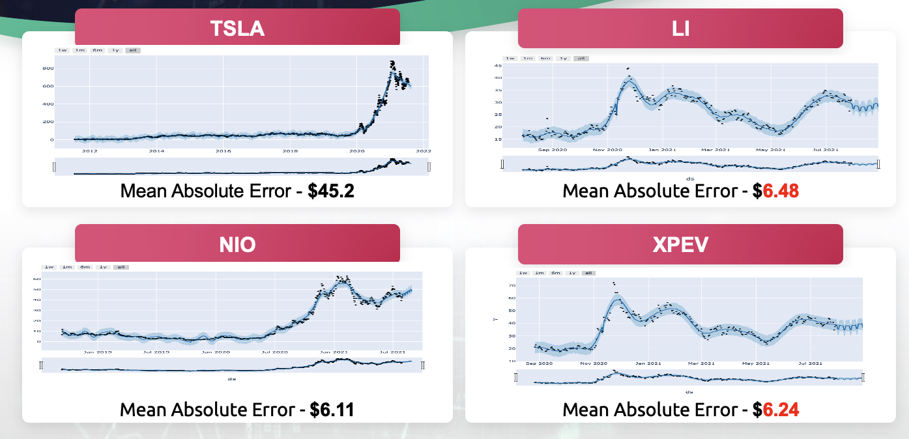
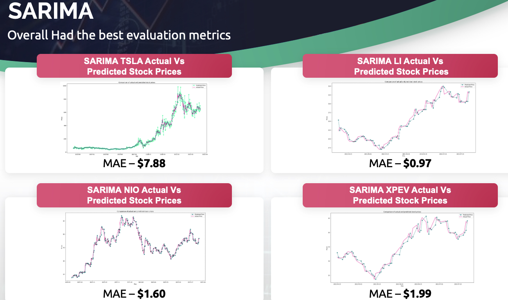

# EV_Stock_Machine_Learning_Predictions
Machine Learning Project to study and make predictions for Electric Vehicle Stocks as a measure for the public perspective on California and EU initiative to phase out internal combustion vehicles by 2035

**Author**: Brian Matsiko

## Overview & Business Problem


Goal of this project is to analyze the current stock and forecast futures of the four companies.
Evaluate whether the greater world are onboard with the new future of only electric vehicles.

***
* How much money to budget for the movie
* A look at the top competitors
* Which director to choose
* When to release the movie
* How long to make the movie
***

## Data
Stocking trading information was sourced from the yahoo API.
Entire trading history was included in this project


## Background
TSLA is the only company based in North America and the other three companies are based out of China.
TSLA has been trading for 12 years
NIO has traded for 3 years
Both LI and XPEV have only been trading for a year

## Methods

In this project, I worked with historical data about the stock prices of the four publicly listed fully electric vehicle manufacturing companies. I implemented a mix of machine learning algorithms to attempt and predict the future stock price of
the given companies, first starting with Long ShortTerm Memory (LSTM) algorithm and then moving on to
advanced techniques like Auto Regressive Integrated Moving Average (ARIMA) and Facebook prophet.

***

## Results

***
The machine learning process was started with deep learning algorithm LSTM (Long Short Term Memory). The Mean Absolute Error was used as the metric for optimizing this algorithm. 


***
Facebook prophet was then also used to make predictions and 


***
Time series models ARIMA and SARIMA were also used to make predictions. SARIMA provided predictions with the best MAE for all the four EV stocks.



## Conclusions

This analysis leads to the following recommendations for creating a movie.
1. **Spend more money to make more money.**
There is a positive corrrelation with how much money is budgeted for a film and how much revenue and profit the film will make. Spending more money on the film usually generates more revenue and profit. If you look at the top 5 most profitable movies released in May since 2010, they had an average budget of around $223 million. These were all movies in one of our highest rated genres, Action,Adventure,Sci-Fi.
2. **Understand your competitors (Walt Disney and Warner Bros) who generate the most revenue per movie.**
These studios have the highest average grossing revenue for those studios who have made over 100 movies. During May, which is the most profitable month of the year, Walt Disney distributed the top 5 highest profitable movies while Warner Brothers distributed top movies by profit in June and July, the 2nd and 3rd highest average profit months respectively.
3. **Engage with the top directors (Christopher Nolan and Joe Russo)**
These top directors have the highest everage rating for movies with more than 30,000 votes in IMDb. Joe Russo and Christopher Nolan directed two of the most profitable films, Captain America: Civil War, and The Dark Knight Rises. They both also direct films in one of the highest rated genres, which is Action,Adventure,Sci-Fi. In addition, they also direct movies for your competitors, Walt Disney and Warner Bros.
4. **Consider releasing during May which is the month that generates the most profit.**
It makes the most sense to release your film during May. May, June and July are the most profitable months of the year. The top 5 most profitable movies in May over the last 10 years were distributed by Walt Disney and profited over $500 million combined.
5. **Consider making your movie longer, rather than shorter.**
The average ratings of movies tend to increase as the length of the movie increases. Our analysis shows the most positive incerease in ratings for movies in the Action, Advneture, Sci-Fi genre up to 200 minute movies.

## Next Steps

Further analysis could provide even more insight into a more wholestic and inclusive valuation trend of these four companies:

**General market and industry inclusion.**
Taking into consideration the general trend of the general stock market and the automotive industry as a whole would greatly help with providing a wholestic picture;

**Stock Volume Analysis.**
Deeper analysis of the volume changes within the stock trading patterns of the four EV stocks would provide a deeper understanding of the trading community interest.

**Publishing all inclusive results on the right medium platform**
Results and evaluation of the all-inclusive machine learning processes should be published on a wide audience medium platform with the goal of creating the respective 


## For More Information

Please review our full analysis in [my Notebook folder](./Notebooks) or my [presentation](./final_presentation.pdf).

For any additional questions, please contact **Brian Matsiko matsikobrian@yahoo.com**

## Repository Structure

```
├── README.md                          
├── Notebooks   
├── final_presentation.pdf         
├── Flas                            
└── Images
```

